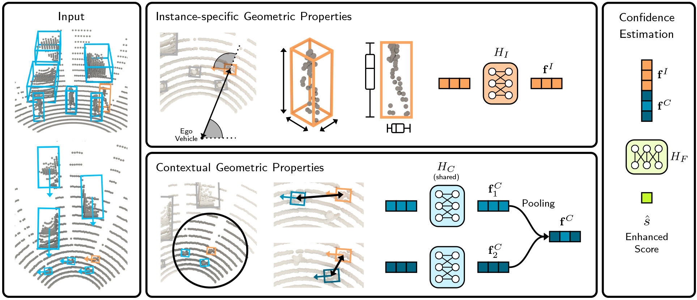

# GACE

This is the demo code for the paper:

**GACE: Geometry Aware Confidence Enhancement for Black-box 3D Object Detectors on LiDAR-Data**
<br>
[David Schinagl](https://dschinagl.github.io), [Georg Krispel](https://scholar.google.at/citations?user=Vt2vlgIAAAAJ&hl=de), [Christian Fruhwirth-Reisinger](https://scholar.google.com/citations?user=Mg5Vlp8AAAAJ&hl=de&oi=ao)
[Horst Possegger](https://snototter.github.io/research/) 
and [Horst Bischof](https://scholar.google.com/citations?user=_pq05Q4AAAAJ&hl=de)
<br>
IEEE/CVF International Conference on Computer Vision (ICCV), 2023
<br>
**[[Paper]](https://openaccess.thecvf.com/content/ICCV2023/papers/Schinagl_GACE_Geometry_Aware_Confidence_Enhancement_for_Black-Box_3D_Object_Detectors_ICCV_2023_paper.pdf) [[Supp.]](https://openaccess.thecvf.com/content/ICCV2023/supplemental/Schinagl_GACE_Geometry_Aware_ICCV_2023_supplemental.pdf)**<br>



## Overview
- [Requirements](#requirements)
- [Demo Example](#demo-example)
- [Acknowledgement](#acknowledgement)
- [Citation](#citation)


## Requirements
* Python 3.8+
* [OpenPCDet](https://github.com/open-mmlab/OpenPCDet) (tested with version `v0.6.0`)
* [PyTorch](https://pytorch.org/) (tested with version `1.13.1`)
* Pretrained [SECOND Model](https://github.com/open-mmlab/OpenPCDet/blob/master/tools/cfgs/waymo_models/second.yaml) on Waymo
* [Waymo Dataset](https://waymo.com/open/)

## Setup
#### 1) OpenPCDet Installation
[https://github.com/open-mmlab/OpenPCDet/blob/master/docs/INSTALL.md](https://github.com/open-mmlab/OpenPCDet/blob/master/docs/INSTALL.md)

#### 2) Waymo Open Dataset Preparation
[https://github.com/open-mmlab/OpenPCDet/blob/master/docs/GETTING_STARTED.md#waymo-open-dataset](https://github.com/open-mmlab/OpenPCDet/blob/master/docs/GETTING_STARTED.md#waymo-open-dataset)

#### 3) SECOND Model Pre-Training
[https://github.com/open-mmlab/OpenPCDet/blob/master/docs/GETTING_STARTED.md#train-a-model](https://github.com/open-mmlab/OpenPCDet/blob/master/docs/GETTING_STARTED.md#train-a-model)

## GACE Demo

We provide a demo code showing the data extraction and training of a GACE model using a SECOND model as the base detector.

Run the demo as follows:
```shell
python gace-demo.py --ckpt ${PRETRAINED_SECOND_MODEL}
```
where `${PRETRAINED_SECOND_MODEL}` is the path to the pretrained model weights.

## Acknowledgement
We thank the authors of [`OpenPCDet`](https://github.com/open-mmlab/OpenPCDet) for their open source release of their codebase.

## Citation

If you find this code useful for your research, please cite

```
@InProceedings{Schinagl_2023_ICCV,
    author    = {Schinagl, David and Krispel, Georg and Fruhwirth-Reisinger, Christian and Possegger, Horst and Bischof, Horst},
    title     = {GACE: Geometry Aware Confidence Enhancement for Black-Box 3D Object Detectors on LiDAR-Data},
    booktitle = {Proceedings of the IEEE/CVF International Conference on Computer Vision (ICCV)},
    month     = {October},
    year      = {2023},
    pages     = {6566-6576}
}
```
